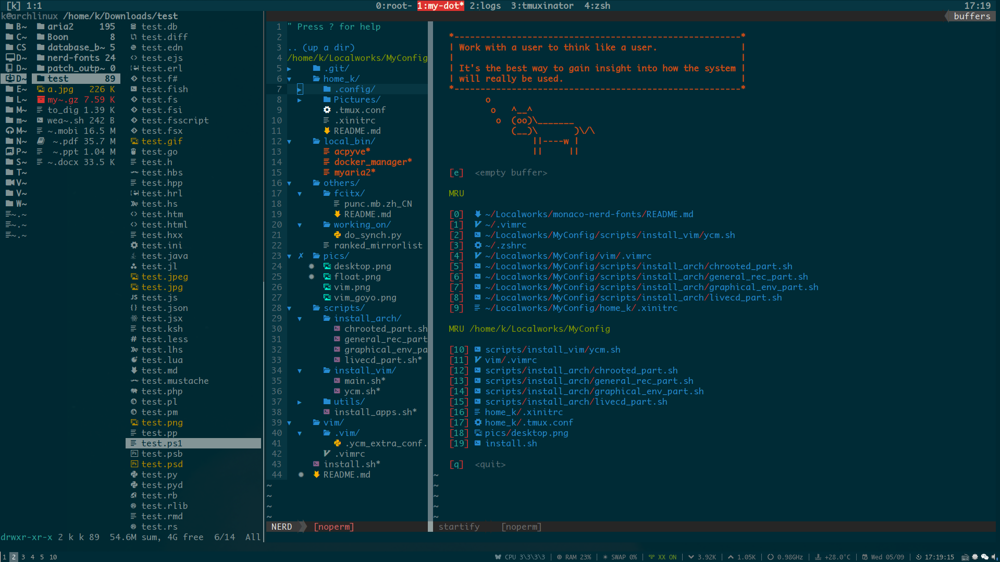

# monaco-nerd-fonts

monaco font patched with extra nerd glyphs

---

### intro

Terminal-friendly fonts created with [nerd patcher](https://github.com/ryanoasis/nerd-fonts).
Working well for now.

### include

- Monaco Nerd Font Complete.otf
- Monaco Nerd Font Complete Windows Compatible.otf
- Monaco Nerd Font Complete Mono.otf
- Monaco Nerd Font Complete Mono Windows Compatible.otf

### usage

Download the font file, mv it to `/usr/share/fonts/<custom-dir>`.
If necessary, run
```
sudo fc-cache -fv
```
or follow [ArchWiki](https://wiki.archlinux.org/index.php/Fonts#Manual_installation) 
to make new fonts available.

### screenshot



