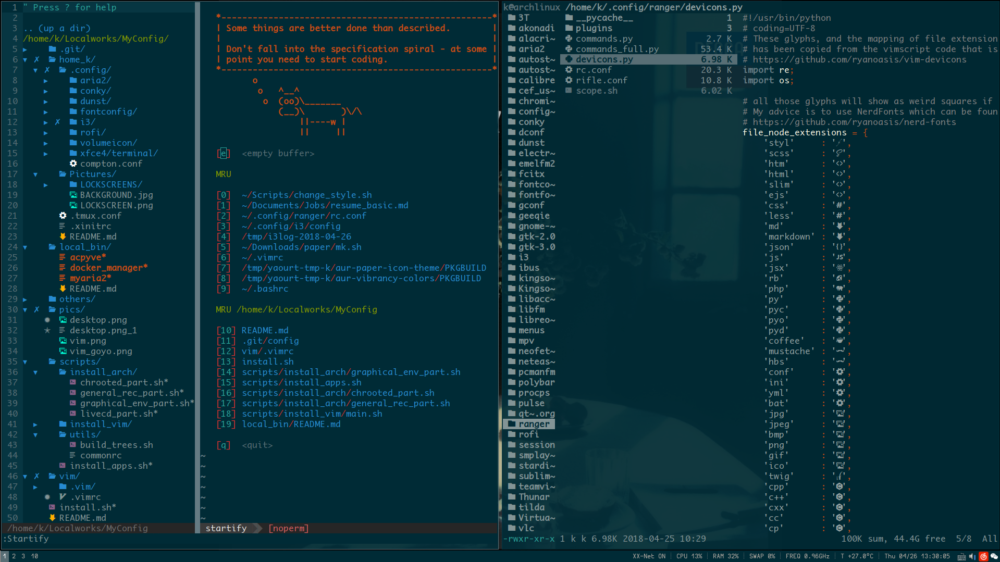

# monaco-nerd-fonts

monaco font patched with extra nerd glyphs

---

### intro

Terminal-friendly fonts created with [nerd patcher](https://github.com/ryanoasis/nerd-fonts).
Working well for now.

### include

- monaco nerd for powerline

### usage

Download the font file, mv it to `/usr/share/fonts/<custom-dir>` and `fc-cache` to use it.

### screenshot

