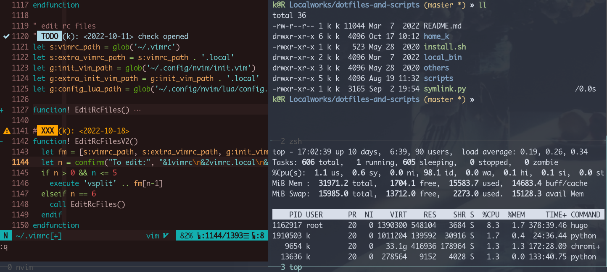
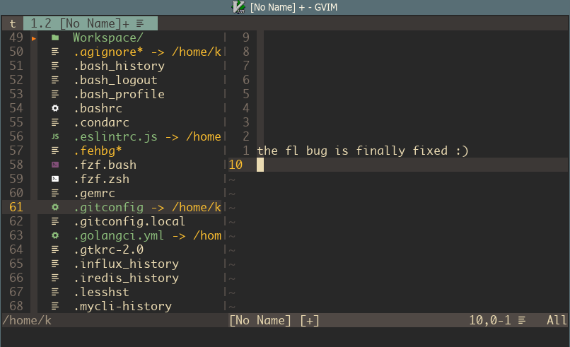

# monaco-nerd-fonts

Terminal-friendly monaco font, with extra nerd glyphs, [patched](./build.sh) with [ryanoasis's nerd patcher](https://github.com/ryanoasis/nerd-fonts#font-patcher).

Build commands are in [build.sh](./build.sh).

### Usage

Download the font file you need, move it to `/usr/share/fonts/anydir`. For example (Linux):

```bash
git clone https://github.com/Karmenzind/monaco-nerd-fonts
cp -r monaco-nerd-fonts/fonts/ /usr/share/fonts/monaco-nerd-fonts
```

If necessary, run `sudo fc-cache -fv` or follow [ArchWiki](https://wiki.archlinux.org/index.php/Fonts#Manual_installation) to make new fonts available.

For **ArchLinux** based distribution, you can directly install via AUR:

```
yay -S ttf-monaco-nerd-font-git
```

### Files

- MonacoNerdFontMono-Regular.ttf
- MonacoNerdFont-Regular.ttf

> if you prefer the old otf version, check out the `old` branch

### Screenshot

Alacritty terminal:



GVim:




### Updates

- 2023-05-30: [Merged](https://github.com/Karmenzind/monaco-nerd-fonts/pull/9) new 3.0.0 version. (thanks to @hjdarnel)
- 2022-10-18: Nerd-fonts repo had [fixed the 'fl' bug](https://github.com/Karmenzind/monaco-nerd-fonts/issues/5#issuecomment-1280295129) (thanks to @Finii) so I patched new fonts. I don't know where to find the original source `otf` file or how to patch the patched font (it created fonts like `Monaco Nerd Font Complete Nerd Font Complete`, don't want to learn how to fix it). The new font are patched based on [this ttf file](https://www.fontmirror.com/monaco). For now it seems pretty good.
- 2019-03-18: Updating freetype2 to version `2.10.*` might break the font on Archlinux. To fix it, check https://github.com/Karmenzind/monaco-nerd-fonts/issues/2 (thanks to @guihkx). I'll update the font file at my leisure time.

